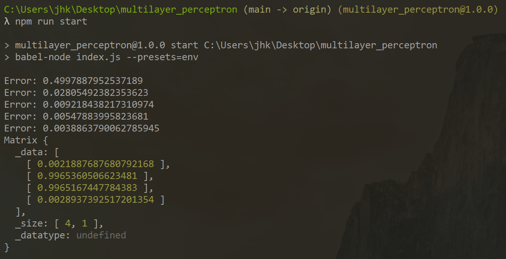

## General information
A multilayer perceptron (MLP) is a class of feedforward artificial neural network, here solving XOR problem.

## Libraries
Project is created with:
* Math.js: 9.0.0

## Setup
`$ npm install`

## Train and test model
`$ node start`

## Results

